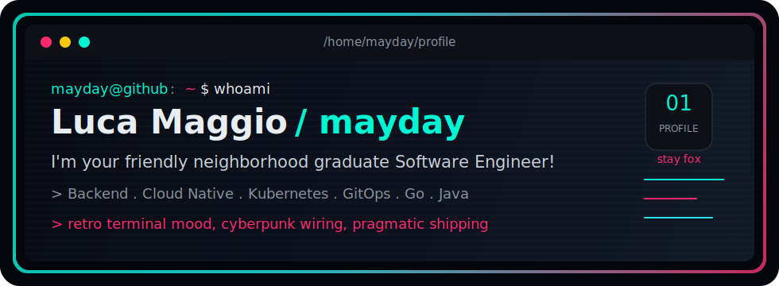

<div align="center">

  

  

  <p>
    <a href="https://github.com/its-me-mayday">
      
    </a>
    <a href="https://www.linkedin.com/in/luca-maggio/">
      
    </a>
  </p>

</div>

---

## Profile

```txt
name:      Luca "mayday" Maggio
role:      graduate Software Engineer / DevOps Engineer
focus:     backend systems, cloud-native platforms, automation
stack:     Kubernetes, GitOps, CI/CD, Go, Java, TypeScript, Terraform/OpenTofu
habits:    Arch Linux, Vim, coffee, tiny tools, weird game prototypes
quote:     I'm your friendly neighborhood graduate Software Engineer!
signoff:   stay fox
```

Computer Engineer from Rome, graduated in Computer and Automatic Engineering at Sapienza University of Rome. I work across backend development, system design and cloud-native applications, with a strong bias for maintainable code, automation and production-ready delivery.

I like infrastructure that can be rebuilt, APIs that age well, and side projects with a bit of static in the neon. Friendly neighborhood energy, production-minded habits.

## Journey

<table>
  <tr>
    <td width="24%"><strong>2026 - now</strong></td>
    <td><strong>Poste Italiane</strong><br/>Graduate Senior Software Engineer / AI Engineer, working on software engineering, DevOps practices and AI-oriented initiatives in an enterprise environment.</td>
  </tr>
  <tr>
    <td><strong>2025</strong></td>
    <td><strong>Mobilize Financial Services</strong><br/>Graduate Senior Software Engineer focused on Kubernetes platforms, GitOps delivery models, CI/CD integration, reliability and cloud-native operations.</td>
  </tr>
  <tr>
    <td><strong>2022 - 2025</strong></td>
    <td><strong>Activa Digital</strong><br/>Graduate DevOps Engineer / Technical Lead supporting development teams with infrastructure automation, CI/CD optimization, Kubernetes, Argo CD, Helm, OpenTofu and platform practices.</td>
  </tr>
  <tr>
    <td><strong>2019 - 2022</strong></td>
    <td><strong>AlmavivA / Key Partner</strong><br/>DevOps, cloud and software engineering roles across backend development, Jenkins/GitLab pipelines, Ruby on Rails, Java Spring Boot, AWS, Azure, Kubernetes and internal applications.</td>
  </tr>
</table>

<p>
  <strong>Education:</strong> Sapienza University of Rome, Computer and Automatic Engineering / Computer Engineering.
  <br/>
  <strong>Certifications:</strong> GitOps Fundamentals, Microsoft Azure Fundamentals, Docker Essentials, DataOps Methodology.
  <br/>
  <strong>Community:</strong> voluntary organizational and leadership activities with Azione Cattolica and local educational initiatives.
</p>

## Toolkit

<p>
  
  
  
  
  
  
  
  
  
</p>

## Telemetry

```txt
mayday@github
------------------------------------------------------------
focus      platform engineering / automation / useful tools
now        Cursus, GitOps labs, small interfaces with signal
runtime    Go, TypeScript, Kubernetes, Linux
style      minimal UI, retro terminals, neon accents
status     shipping, refactoring, learning in public
------------------------------------------------------------
```

<table>
  <tr>
    <td><strong>builds</strong></td>
    <td>GitOps labs, realtime data services, frontend control panels</td>
  </tr>
  <tr>
    <td><strong>cares about</strong></td>
    <td>reproducible infra, clean deploy paths, fast feedback loops</td>
  </tr>
  <tr>
    <td><strong>side quests</strong></td>
    <td>roguelike systems, pixel interfaces, tiny CLIs</td>
  </tr>
</table>

## Contact

<p>
  <a href="https://www.linkedin.com/in/luca-maggio/">LinkedIn</a> /
  <a href="https://github.com/its-me-mayday">GitHub</a>
</p>

<div align="center">
  
</div>
